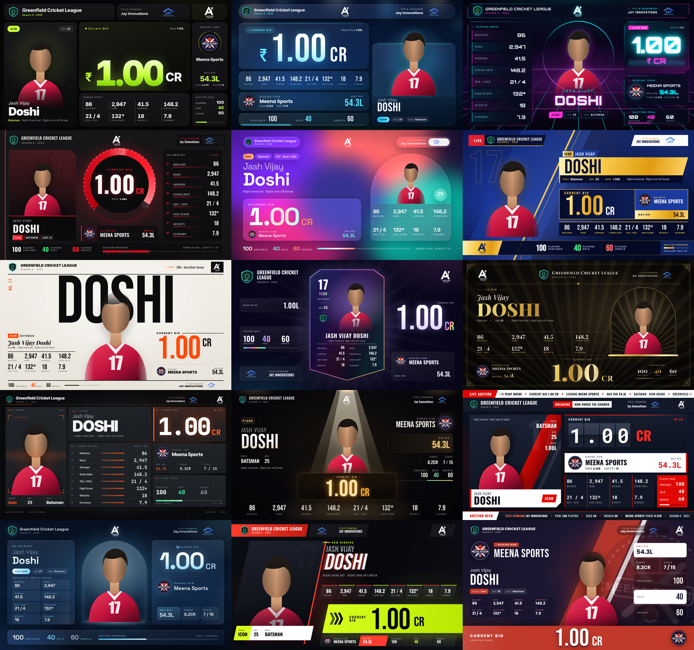

# Auction Arena · Templates

- **15 main-display layouts** for the live auction screen, each a single HTML file drawn on a fixed 1920x1080 canvas that scales to any monitor.
- **6 YouTube live overlays**: transparent 1920x1080 pages for an OBS / vMix browser source.
- **6 story player cards**: phone-size 1080x1920 cards with a Download PNG button, for Instagram and WhatsApp stories.

Every overlay and story card also ships as a Laravel Blade view in `blade/`.

**Live gallery:** https://nirmitsachde.github.io/auction-arena-templates/

## Structure

- `index.html`: gallery linking every template
- `templates/NN-name.html`: the 15 templates (plain HTML + CSS, no build step)
- `overlays/NN-name.html`: the 6 live overlays
- `stories/NN-name.html`: the 6 story cards
- `blade/`: generated Blade views of the overlays and stories (see [blade/README.md](blade/README.md))
- `tools/build-blade.mjs`: regenerates `blade/` from the HTML (`node tools/build-blade.mjs`)
- `shared/`: data payload, tiny runtime, base stylesheet, overlay and story layers
- `assets/`: placeholder logos and player image
- `screenshots/`: 1920x1080 render of each template

Run locally by opening `index.html` in any modern browser. MIT licensed.

## How it works

- `shared/data.js`: the one live payload (tournament, sponsor, player, stats, status counts, bid, team). Every template reads only from this.
- `shared/aa.js`: fills `data-bind` / `data-src` fields, renders stats, scales the canvas, pulses values when they change. Call `AA.update({ bid: { amount: "1.50" } })` from the real backend.
- `shared/base.css`: reset + the 1920x1080 stage.
- `shared/overlay.css`: transparent page, SOLD / UNSOLD strip and stamp. Add `?preview` to an overlay URL (or press B) for a sample camera frame behind it.
- `shared/story.css` + `shared/story.js`: the 1080x1920 stage, one-line name fitting and the html2canvas PNG download.
- Demo keys: SPACE or → raises the bid, T switches the bidding team, S / U / L set sold / unsold / live.
- Open `index.html` for the gallery.
- Swap `assets/player.svg` for a transparent-background player cut-out PNG for the best look.

## Concepts

1. **Bento Noir**: Apple-keynote bento grid on near-black; every data point in its own rounded tile, electric lime accent, the bid tile takes a 2x2 hero cell.
2. **Stadium Glass**: blurred floodlight bokeh behind frosted glass panels; player cut-out breaks out of the glass, soft cyan edge light.
3. **Neon Grid**: cyberpunk HUD; perspective grid floor, cyan and magenta glow lines, angular clipped panels, scanline shimmer on the bid.
4. **Carbon Pro**: F1 pit-wall aesthetic; woven carbon fibre texture, racing-red accents, telemetry-style stat bars and a speedometer-style bid readout.
5. **Aurora Mesh**: Pitch.com style animated mesh gradient (violet, coral, teal) with soft glass cards and generous whitespace; calm but premium.
6. **Prime Broadcast**: IPL-style TV package; navy and gold diagonal slashes, stacked lower-third bars, sponsor bug and "LIVE" chip.
7. **Editorial**: magazine cover layout; giant Bebas surname behind the player, monochrome with a single hot-orange accent, numbers as typographic heroes.
8. **Ultimate Card**: player presented as a holographic collectible card (FUT style) centre stage, animated foil sheen, stats on the card face.
9. **Black Gold**: luxury black and gold, thin art-deco line work, serif display type for the name, gold-foil gradient bid.
10. **Data Terminal**: Swiss grid, NFL Next Gen Stats vibe; graphite and signal orange, every stat with a mini bar, monospace figures.
11. **Spotlight**: dark arena with a volumetric spotlight cone on the player, dust particles, bid glowing like a scoreboard.
12. **Ticker Live**: sports-news energy; scrolling ticker rails top and bottom, split-flap style bid digits, breaking-news red.
13. **Arctic Frost**: ice-blue and white glass on deep midnight, crisp thin type, frosted stat tiles, subtle snow-light shimmer.
14. **Velocity**: motion-blur speed streaks, everything skewed on a 12° diagonal, kinetic chevrons pointing at the bid.
15. **Team Takeover**: the bidding team owns the screen; its colours flood the background and accents (CSS variables), giant watermark crest.

## Live overlays

Each one keeps the centre of the frame clear for the camera.

1. **Royal Ribbon**: IPL-style navy and gold lower third; the photo medallion breaks out of the ribbon, with a gold bid plate and a white team roundel.
2. **Glass Dock**: one floating frosted pill at the bottom, monochrome with a lime live bid.
3. **Side Rail**: esports-style rail down the left edge; the bidding team's colour runs down the spine and fills the bid.
4. **Neon Strike**: cyberpunk HUD; angled cyan player bar, magenta bid core, scanlines.
5. **Score Strip**: cricket TV scorebug plus a ticker; covers the least of the camera.
6. **Team Flood**: the bidding team's colour floods the bid block, with the crest as a watermark.

## Story cards

Built for html2canvas, so the PNG matches the screen. That rules out clip-path, masks, filters, blend modes, gradient text, repeating gradients, soft black box-shadows and the Anton / Bebas fonts, whose baselines drift.

1. **Gold Rush**: black-tie gold, arched portrait, serif name.
2. **Stadium Night**: floodlit sky, photo card edged in the team's colour, white price slab.
3. **Team Colours**: a "Welcome to" card in the buying team's colour, made for the team to repost.
4. **Magazine**: cover-of-the-week layout with a giant surname and red cover lines.
5. **Neon Pulse**: synthwave sun, neon ring portrait, horizon grid.
6. **Trading Card**: the player as a gold collectible card.
